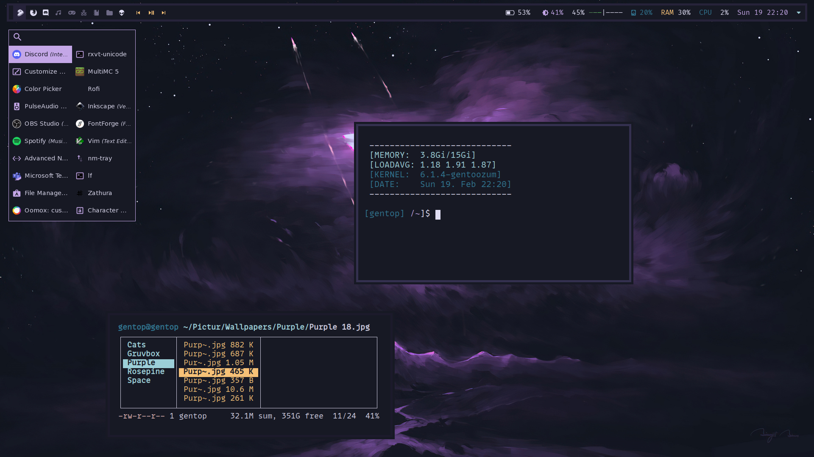

# Welcome to my dotfiles

Hey!

# Table of contents
- [Overview](#overview)
- [Screnshots](#screenshots)
- [Keybinds](Keybinds)

# Overview
- Operating System: `Gentoo Linux`
- Window Manager: `Bspwm`
- Borders: `chwb2` 
- Launcher: `Rofi`/`Dmenu` 
- Notifications: `Dunst`
- Terminal: `St`
- File mananger: `Ranger/Pcmanfm`
- Editor: `Neovim`
- Pdf Viewer `Zathura`
- Web Browser: `Firefox`
- Music Player: `Spotify`
- Wallpapers: `Feh`

<details open>
<summary>Misc tty stuff</summary>
<br>

- tty-clock
- cpufetch
- sl
- cowsay
- pipes
- btop
- htop
- cmatrix
- exa

</details>

# Screenshots
 ## Bspwm


```
## Keybindings

|    Keybind    |  Application  |      Function     |
| ------------- | ------------- | ----------------- |
|` Super + x`   | St            | Terminal          |
| `Super + r`   | Rofi          | Run Launcher      |
| `Super + e`   | Ranger        | Open Filemananger |
| `Super + b`   | Firefox       | Open Browser      |
| `Super + s`   | Flameshot     | Screenshot        | 
| `Super + w`   | Bspwm         | Close Window      |
| `Super + d`   | Dmenu         | Dmenu open        |
```
> This is still a work in progress. 
